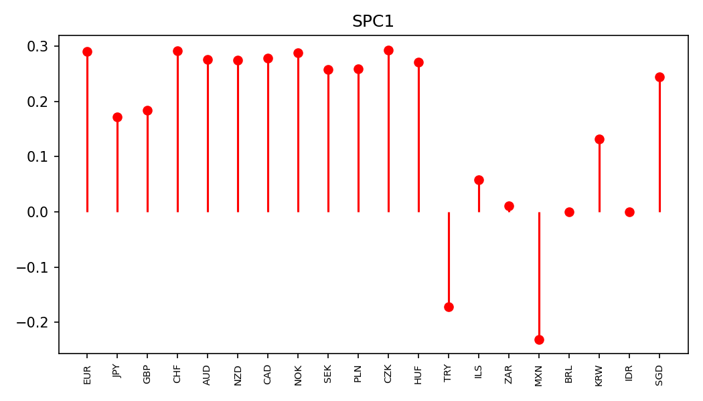
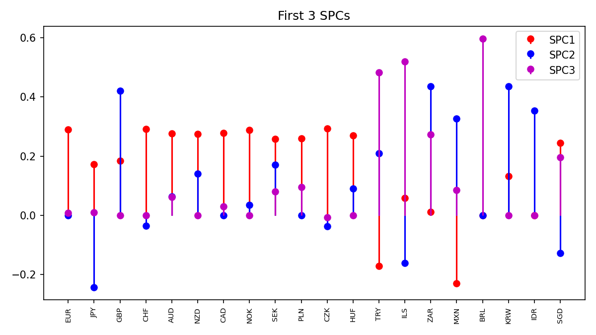
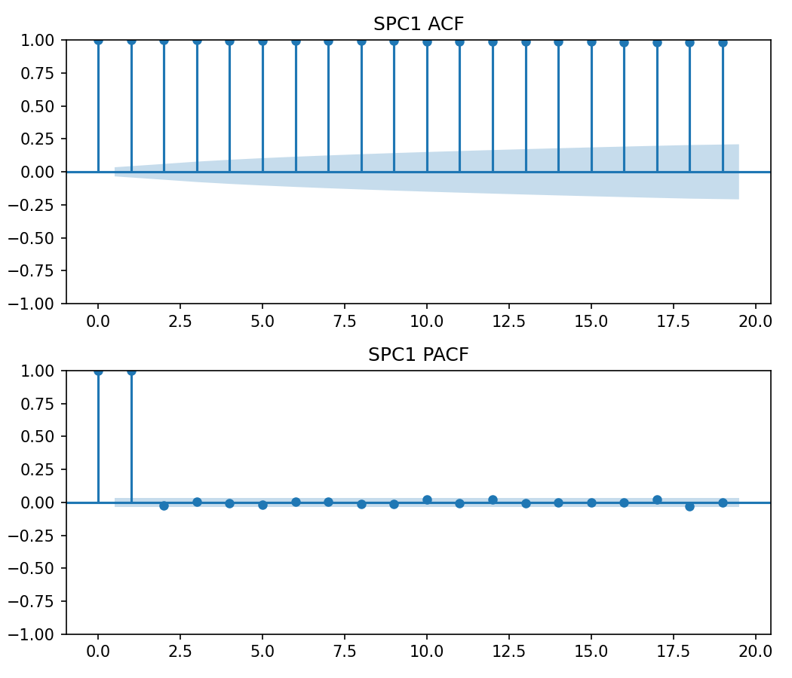
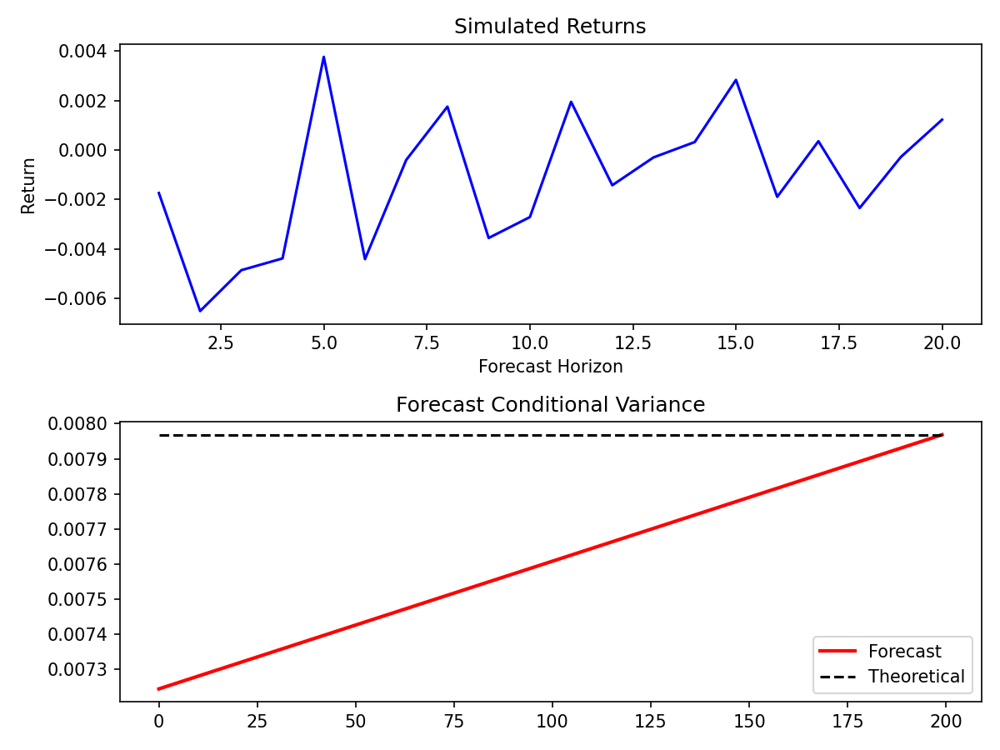

# FX Sparse PCA + GARCH Volatility Modeling

> New here? [Plain-English overview](OVERVIEW.md) explains what this does and why, without the stats jargon.

Dimension reduction and conditional-volatility modeling for a panel of 20
foreign-exchange rates, using sparse PCA to compress correlated currencies
into a few interpretable components and a GARCH-family model comparison to
capture the volatility clustering in each one.

This is a Python port of a graduate time-series course project (Stat 575:
Time Series Analysis, Fall 2024) originally implemented in MATLAB. The
methodology is unchanged; the implementation is not — see
["What changed from the original"](#what-changed-from-the-original) below.

## What it does

1. **Dimension reduction.** Loads 3,202 daily observations of 20 exchange
   rates (EUR, JPY, GBP, CHF, AUD, NZD, CAD, NOK, SEK, PLN, CZK, HUF, TRY,
   ILS, ZAR, MXN, BRL, KRW, IDR, SGD), normalizes them to a correlation
   scale, and fits sparse PCA for a range of component counts. The number of
   components is chosen by scoring each fit with four information criteria
   (AIC, CAIC, SBC, and ICOMP — the last one a Bozdogan information-
   complexity penalty rather than a flat parameter count).
2. **Structure check.** Stem-plots the sparse loadings and plots the ACF/PACF
   of the resulting component scores to check for the autocorrelation and
   volatility clustering that motivate a GARCH model.
3. **Volatility model comparison.** Fits GARCH(1,1), EGARCH(1,1), and
   GJR-GARCH(1,1) to each retained component and picks the best one per
   component by AIC / BIC / ICOMP.
4. **Order search + forecast.** Grid-searches GARCH(p, q) for p, q up to 4 on
   the component with the most explained variance, and forecasts the
   conditional variance and simulated returns from the best-fitting model.

## Results

Run against the real 3,202-day, 20-currency panel (`python run_analysis.py`):

**SPC1 loadings** separate the panel almost perfectly into developed-market
currencies (EUR, CHF, AUD, NZD, CAD, NOK, SEK, PLN, CZK, HUF, SGD, JPY, GBP —
all loading ~0.17-0.29) versus emerging-market ones (TRY and MXN load
strongly *negative*, at -0.17 and -0.23; ZAR, BRL, IDR sit near zero). That's
a clean, economically interpretable factor to fall out of an unsupervised
method with no currency labels used in fitting it.




SPC1/2/3 jointly capture **70.4% / 15.1% / 14.5%** of the (adjusted, QR-based)
variance. The information-criteria sweep over k=1..10 components picks k=2 by
every criterion (AIC, CAIC, SBC, ICOMP all agree) — one fewer than the 3
components carried forward here to match the original write-up's structure;
see the caveat below on why this sweep is noisier than the original
inverse-power-method version.

ACF/PACF of the SPC scores stay near 1 at every lag (the components are built
from FX rate *levels*, not returns, so this is expected — a near-random-walk
process), which motivates fitting volatility models directly to the levels
rather than daily changes:



**GARCH(1,1) beats EGARCH(1,1) and GJR-GARCH(1,1) for all three SPCs, by all
three criteria (AIC/BIC/ICOMP unanimous)** — no asymmetric-leverage or
exponential specification improves on the plain model here. The GARCH(p,q)
grid search (p,q = 1..4) on SPC1 confirms (1,1) as the AIC-best order too;
every larger model overfits. The fitted SPC1 GARCH(1,1) lands almost exactly
on the IGARCH boundary (α=0.934, β=0.066, α+β≈1.000), so the forecast's
long-run variance is a plateau rather than converging to a finite
unconditional value — the plot below falls back to the terminal forecast
value for the dashed line, as noted in the code:



Full CSV tables (`results/*.csv`) and all 8 figures are regenerated by
rerunning the pipeline — see below.

## Repo structure

```
fx-volatility-sparse-pca/
├── data/FxData.xlsx           # daily FX levels, 20 currencies x 3202 days
├── docs/figures/               # a few committed result figures (for GitHub preview)
├── src/
│   ├── data_utils.py          # loading + correlation-scale normalization
│   ├── sparse_pca.py          # sparse PCA fit + AIC/CAIC/SBC/ICOMP scoring
│   ├── volatility_models.py   # GARCH/EGARCH/GJR fitting + IC comparison
│   └── plotting.py            # stem plots, ACF/PACF, forecast plots
├── tests/                      # test_data_utils.py, test_sparse_pca.py,
│                               # test_volatility_models.py
├── run_analysis.py            # end-to-end driver script
├── requirements.txt
└── LICENSE                    # MIT
```

## Running it

```bash
python -m venv .venv && source .venv/bin/activate
pip install -r requirements.txt
python run_analysis.py --data data/FxData.xlsx --out results/
```

This writes information-criteria tables (CSV) and figures (PNG) to
`results/` (git-ignored — regenerate anytime by rerunning, results are not
identical run-to-run since `sklearn.SparsePCA`'s coordinate descent has a
random component). Runtime is well under a minute (~10s on a laptop), mostly
spent fitting the GARCH(p, q) grid. `docs/figures/` holds a fixed, committed
snapshot of the figures referenced in [Results](#results) above.

## Tests

```bash
python -m unittest discover -v
```

- `test_data_utils.py` — `normalize_columns` (centering/unit-norm properties,
  zero-variance column edge case) and `load_fx_data` (shape, column names,
  numeric sanity) against the real dataset. Needs only numpy/pandas/openpyxl.
- `test_sparse_pca.py` — regression tests for a bug where the sparsity
  penalty `alpha` was set 1-2 orders of magnitude too high for this
  correlation-scale-normalized data, collapsing every loading to exactly
  zero; covers both "the current default doesn't collapse" and "an
  over-large alpha is now caught with a clear error instead of propagating
  NaNs downstream." Needs `scikit-learn`.
- `test_volatility_models.py` — regression tests for a bug where fitting on
  an internally-rescaled series never scaled the reported log-likelihood /
  AIC / BIC / parameter covariance back down; checks that AIC/BIC/ICOMP and
  the fitted `omega` are invariant to the (internal, arbitrary) `scale`
  value used for optimizer conditioning. Needs `arch`.

All 10 pass as of this commit (`pip install -r requirements.txt` first).

## What changed from the original

The original MATLAB analysis leaned on two pieces of third-party code that
aren't mine to redistribute, so this port replaces them with standard,
appropriately-licensed Python equivalents rather than translating them
line-for-line:

- **Sparse PCA algorithm.** The MATLAB script used Hein & Bühler's inverse
  power method for nonlinear eigenproblems (NIPS 2010, GPL-licensed research
  code). This port uses `sklearn.decomposition.SparsePCA`, a coordinate-
  descent / elastic-net formulation (Zou, Hastie & Tibshirani, 2006). Same
  goal — sparse loadings — different algorithm, so the exact loading values
  and information-criteria numbers won't match the original MATLAB run.
- **GARCH estimation.** MATLAB's Econometrics Toolbox (`garch`, `egarch`,
  `gjr`) is replaced with the `arch` package, the standard Python library for
  conditional volatility models, using the equivalent (1,1) specifications
  for each model family.
- **Information-criteria formulas** (AIC, CAIC, SBC, and the ICOMP
  information-complexity criterion used throughout the course) are
  reimplemented in `src/sparse_pca.py` and `src/volatility_models.py`
  directly from their published mathematical definitions — not copied from
  the instructor-provided MATLAB template, which carries its own
  proprietary/no-redistribution notice.
- The "adjusted variance" used in the sparse-PCA information criteria is
  computed generically via QR decomposition of the component scores (Zou,
  Hastie & Tibshirani, 2006, Sec. 3.4), so it works with any sparse PCA
  algorithm rather than depending on values a specific solver happens to
  report internally.

Because of the algorithm swap, don't expect this port's numbers to match the
original write-up's Table 1 (e.g. AIC = -971939.87 for the first component).
The point of the port is a clean, reusable, appropriately-licensed
implementation of the same modeling workflow, not a bit-for-bit
reproduction.

## Data note

`data/FxData.xlsx` contains historical FX rate levels compiled for the
original coursework. These are factual exchange-rate levels rather than
copyrightable content, but if you'd rather source your own, any daily FX
series from a public source (e.g. FRED, ECB) with the same 20-currency,
long-panel structure will work as a drop-in replacement.

## Verification status

`run_analysis.py` has been executed end-to-end against the real 3,202 x 20 FX
dataset (not just checked for control flow) and produces finite, sane-looking
tables and figures throughout. That run surfaced and fixed two real bugs from
an earlier version of this port that had only been reviewed, not executed:

- **`SPARSITY_ALPHA` was 1.0.** `normalize_columns` scales each column to
  unit Euclidean *norm* (not unit variance), so entries are ~1/sqrt(n) in
  magnitude — an L1 penalty of 1.0 is 1-2 orders of magnitude too large and
  drove every sparse-PCA loading to exactly zero, for every k from 1 to 10.
  That degenerate all-zero fit didn't crash immediately: it silently
  produced a meaningless information-criteria table (a `+1e-8*I`
  regularization fallback masked the singular covariance), NaN "percent
  variance explained," and only failed loudly once a zero-variance
  component score hit the GARCH stage (`LinAlgError: Eigenvalues did not
  converge`). Fixed by lowering the default to 0.06 (chosen empirically —
  see `fit_sparse_pca`'s docstring) and by having `fit_sparse_pca` raise
  immediately if any component still collapses to all-zero, rather than
  letting NaNs propagate.
- **GARCH log-likelihood/AIC/BIC/parameter-covariance were never unscaled.**
  `_fit_one`/`grid_search_garch` fit on `r * scale` (`arch`'s recommended fix
  for its optimizer's sensitivity to small-variance series) but returned
  `result.aic`/`result.bic`/`result.param_cov` as-is, which are computed on
  the *scaled* series. Model selection (which family/order wins) was still
  correct, since the same constant shift applies to every model compared at
  a fixed scale, but the absolute numbers in the printed tables/CSVs were
  off by a large, scale-dependent constant, and `omega` was left in the
  wrong units. Fixed by analytically mapping the log-likelihood and
  parameter covariance back to `r`'s original units (see
  `_rescale_transform` in `src/volatility_models.py`); `tests/
  test_volatility_models.py` regression-tests this by checking the fit is
  invariant to the (arbitrary, internal) choice of `scale`.

One remaining caveat worth knowing about before you present the k-selection
result: `select_number_of_components`'s IC values are **not monotonic or
smooth in k** the way the original write-up's Table 1 is (which itself has a
clean single minimum). Refitting `sklearn.decomposition.SparsePCA`
independently at each k means each fit is its own non-convex coordinate-
descent optimization with no shared warm start, so the criteria can dip and
recover erratically across k (observed: a sharp, isolated drop at k=5 on
this dataset). Treat the "best k" output as indicative, not as precise as
the original inverse-power-method's deflation-based sweep, which updates one
component at a time from a shared basis.

Also note: this port's GARCH(1,1) fit to SPC1 lands almost exactly on the
IGARCH boundary (alpha+beta ≈ 1), unlike the original write-up's comfortably
stationary ~0.997. `omega/(1-alpha-beta)` is undefined there, so
`run_analysis.py` falls back to the terminal forecast variance instead and
prints a warning — this is a property of fitting GARCH directly to FX-level
(not return) scores, not a bug, but it's why the forecast plot's dashed
"Theoretical" line is a stand-in rather than a true unconditional variance.

## License

MIT (see `LICENSE`). Unlike the original coursework, which depended on a
GPL-licensed MATLAB toolbox for the sparse PCA step, everything in this repo
is either original code or built on permissively-licensed libraries
(scikit-learn, `arch`, statsmodels), so it's freely reusable.
